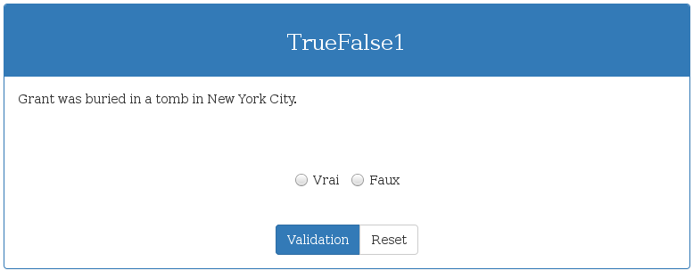
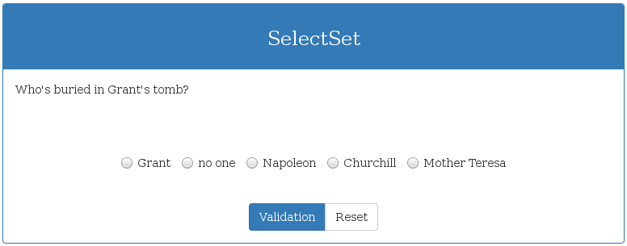
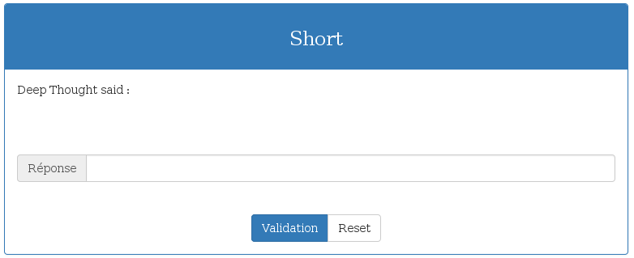
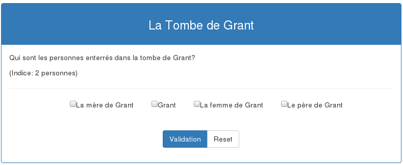
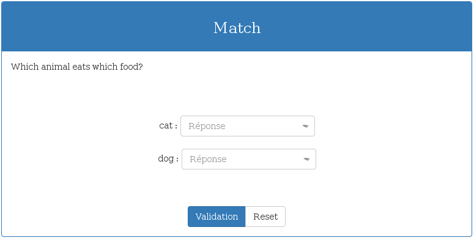

# Écriture d'un Formulaire
Une partie importante de l'exercice est le formulaire. Cette partie permet de définir la manière de répondre de l'utilisateur (champs de saisie, boutons radios, éditeur...). Bien que divers formulaires existent déjà, il se peut qu'il ne vous conviennent pas et que vous souhaitez en écrire un personalisé.

Un formulaire peut être relativement simple, un champs texte, par exemple:
```html
form==
<span class="input-group-addon">Réponse</span>
<input id="form_txt_answer" type="text" class="form-control" placeholder="" required>
==
```
Ou bien plus compliqué, pour une question à champs multiples:
```html
form==
<center>
    <div style="display: inline-block; vertical-align: middle;">
        
            <span class="input">{{item}}:</span>
            <select id="form_txt_{{item}}" class="selectpicker" style="display: inline-block; vertical-align: middle;" title="Réponse" required>
                
                    <option value="{{ item2 }}">{{item2}}</option>
                
            </select>
            <br>
            <br>
        
    </div>
</center>
==
```

Comme vous pouvez le voir, des connaissances de bases en **HTML** sont nécessaires, je vous invites à vous rendre sur la page correpsondante de [w3schools](https://www.w3schools.com/html/html_forms.asp) si besoin d'une piqûre de rappel.

Pour des formulaire plus compliqués, des connaissances sur les **gabarits Django** (**jinja2** simplifié) seront aussi nécessaire.

Enfin, si l'écriture d'une [fonction build](./build.html) est nécessaire, des connaissances en Python 3 seront requis.
Ce guide vous guidera pas-à-pas dans l'écriture d'un formulaire personnalisé.

## Les Bases
Un formulaire est déclaré dans un PL grâce à la clé *form*. Il doit être écrit en *html*, et peut, si besoin, se servir de css/js externe. 
Ce formulaire ne doit contenir ni de balises **\<form\>\<\/form\>**, ni de bouton **submit**, ceux-ci étant ajouté après par la plateforme.

Il est possible d'utiliser n'importe quelle type d'*input* accépté par *HTML5*, **excepté**  ***submit***:
* text
* radio
* checkbox
* button
* color
* date
* datetime-local
* email
* month
* number
* range
* search
* tel
* time
* url
* week

Voir [les types d'inputs sur w3schools](https://www.w3schools.com/html/html_form_input_types.asp)

Pour que la plateform accepte les réponses de ses *inputs*, ils doivent posséder une idée de la forme: **form_XXX_YYYYY**
Où *xxx* est le type d'input sur 3 lettres (txt, int, flt, etc...; cette carastéristique n'est pas encore implémentée et importe donc peu pour le moment) et *yyyyy* le nom de l'*input*

Le champs name n'est donc requis pour aucun *input*, **excepté** celui de type *radio*, n'autorisant ainsi seulement une case d'un groupe de case radio portant le même nom d'être cochée.

Lors de la validation du formulaire par l'élève, la plateforme créera un dictionnaire contenant chaque *input* en tant que clés et la réponse de l'utilisateur en tant que valeur. Par exemple avec le formulaire suivant:
```html
form==
<input id="form_txt_answer1" type="text" class="form-control" placeholder="" required>
<input id="form_txt_answer2" type="text" class="form-control" placeholder="" required>
==
```
Si l'élève réponds respectivement "Oui" et "Pomme", la plateforme enverra à la fonction d'évaluation:
```python
{
    "answer1": "Oui"
    "answer2": "Pomme"
}
```
Tout les *inputs* retourne un seul élément, que ce soit un mot, une date (dd-mm-yyyy) une couleur (#XXXXXX), etc...
La seul exception est le type **checkbox**, celui-ci renverra une liste associée au nom de l'input:
```html
    <input type="checkbox" id="form_txt_langage" value="c"> C
    <input type="checkbox" id="form_txt_langage" value="python"> Python
    <input type="checkbox" id="form_txt_langage" value="caml"> Caml
    <input type="checkbox" id="form_txt_langage" value="java"> Java
```
Enverra, si l'utilisateur choisi C, Python et Java:
```python
{
    "langage": ["c", "python", "java",]
}
```
Si l'utilisateur choisi juste C:
```python
{
    "langage": ["c"]
}
```

## CSS
Il est tout à fait possible d'ajouter du css avec la balise **style="*attribut*: *valeur;***"
***VOIR AVEC M. REVUZ SI LAISSÉ LES PROFS IMPORTÉ DU CSS, AU RISQUE D'ÉCRASER CELUI DU SITE***

## Formulaire Réutilisable
Jusqu'ici, la plupart des formulaires montrés en exemple n'étaient utilisables qu'avec un seul exercice, la valeur des réponses étant rentré en dur. Afin de créer des formulaire réutilisable (ce qui est bien évidemment recommandé), il est nécessaire de connaitre le **Django Template Language** (*Langage de Gabarit Django*), je vous invite pour cela à jeter un coup d'oeil à ces deux pages:
* [Gabarits Django](https://docs.djangoproject.com/fr/1.10/topics/templates/#variables) Pour comprendre l'utilisation des variables.
* [Référence des Balises Django](https://docs.djangoproject.com/fr/1.10/ref/templates/builtins/#ref-templates-builtins-tags) Pour comprendre l'utilisation des balises *if*, *else* et *for*.

Ce langage permet donc d'utiliser les variables du *contexte django* pour remplir votre formulaire html. Cela tombe très bien car **toutes** les variables déclarées dans votre PL, ainsi que celle créée par la fonction *build*, si déclarée, se trouve dans le contexte. Il est donc possible de remplir un formulaire grâce au variables déclaré dans un PL. Pour bien comprendre, voici un exemple de formulaire permettant de choisir entre deux réponses:
```html
form==
<input id="form_txt_answer" type="radio" value="{{answer1}}" name="answer" required> {{answer1}}
<input id="form_txt_answer" type="radio" value="{{answer2}}" name="answer">{{answer2}}
==
```
Dans cet exemple, les mots *{{answer1}}* et  *{{answer2}}* seront remplacés par les valeurs des clés *answer1* et *answer2* déclaré dans votre PL. Par exemple avec ce PL:
```
title=Couleur
text==
Quelle couleur préférez-vous entre:
* Le bleu?
* Le rouge?
==
answer1=rouge
answer2=bleu
include=chemin/vers/votre/formulaire.pl
```
Le formulaire devient:
```html
<input id="form_txt_answer" type="radio" value="rouge" name="answer" required> rouge
<input id="form_txt_answer" type="radio" value="bleu" name="answer"> bleu
```
Ce formulaire permet donc maintenant de répondre à n'importe quelle question demandant un choix entre **deux réponses**.

Deux réponses ? Voilà qui limite bien ce formulaire, améliorons-le afin qu'il puisse maintenant accepter un nombre non indéfinis de réponses.
Nous aurons pour cela besoin d'une [fonction build](./build.html).

Supposons que nous souhaitons pouvoir rentrer un nombre infinis de réponses grâce à des champs *answerX* où *X* représente un nombre entier, il nous dans un premier temps mettre l'ensemble de ces réponses dans une liste, c'est là qu'intervient la fonction build:
```python
def build(dic):
    n=1
    answer=list()
    while ('answer'+str(n) in dic):
        answer.append(dic['answer'+str(n)])
        n += 1
    dic['answer'] = answer
    return dic
```
Cette fonction permet donc d'ajouter dans le contexte une liste nommer *answer* contenant chacune des réponses, ils nous suffit alors de boucler dessus dans notre formulaire:
```html

    <input id="form_txt_answer" type="radio" value="{{item}}" name="answer" required>{{item}}

```
Voilà maintenant un formulaire qui permet de répondre à une question demandant de choisir une réponse sur X réponses proposées.

## Exemple
Voici les formulaires (ansi que fonctions [./build.html](build) associées, si existantes) de divers types d'exercices.

##### Vrai / Faux
PL:
```
title=Vrai / Faux
text=Grant a été enterré à New York.
answer=True
extends=/gift/template/truefalse_template.pl
```
Formulaire
```html
form==
<center>
    <label class="radio-inline">
        <input id="form_txt_answer" type="radio" value="True" required> Vrai
    </label>
    <label class="radio-inline">
        <input id="form_txt_answer" type="radio" value="False" > Faux
    </label>
</center>
==
```
Rendu:


##### QCM a Réponse Unique
PL:
```
title=QCM
text=Qui est enterré dans la tombe de Grant?
extends=/gift/template/select_template.pl
answer1=Grant
answer2=Personne
answer3=Napoleon
answer4=Churchill
answer5=Mother Teresa
right_answer=Grant
```
Build:
```python
build==
def build(dic):
    n=1
    answer=list()
    while ('answer'+str(n) in dic):
        answer.append(dic['answer'+str(n)])
        n += 1
    dic['answer'] = answer
    return dic
==
```
Formulaire:
```html
form==
<center>
    
        <label class="radio-inline">
        <input id="form_txt_answer" type="radio" value="{{item}}" required>{{item}}
        </label>
    
</center>
==
```
Rendu:


##### Réponse Courte
PL::
```
title=Short
text=Deep Thought said:
extends=/gift/template/short_template.pl
answer=forty two
correct_feedback=Correct according to The Hitchhiker's Guide to the Galaxy!
wrong_feedback=Incorrect !
```
Formulaire:
```html
form==
<div class="input-group">
    <span class="input-group-addon">Réponse</span>
    <input id="form_txt_answer" type="text" class="form-control" placeholder="" required>
</div>
==
```
Rendu:


##### Réponse Numérique
PL:
```
title=Intervalle
text=Donnez un nombre entre 1 et 5.
extends=/gift/template/numeric_template.pl
mini=1
maxi=5
```
Formulaire:
```html
form==
<div class="input-group">
    <span class="input-group-addon">Réponse</span>
    <input id="form_txt_answer" type="text" class="form-control" placeholder="" required>
</div>
==
```
Rendu:


##### QCM
PL:
```
title=La Tombe de Grant

text==
Qui sont les personnes enterrés dans la tombe de Grant?

(Indice: 2 personnes)
==

type=direct
template=/gift/template/multiplechoices_template.pl
answer1=La mère de Grant
answer2=Grant
answer3=La femme de Grant
answer4=Le père de Grant
right_answer1=Grant
right_answer2=La femme de Grant
```
Build:
```python
build==
def build(dic):
    d= dict(dic)
    n=1
    question=list()
    answer=list()
    while ('answer'+str(n) in dic):
        question.append(dic['answer'+str(n)])
        if 'right_answer'+str(n) in dic:
            answer.append(dic['right_answer'+str(n)])
        n += 1
    d['question'] = question
    d['answer'] = answer
    return d
==
```
Formulaire:
```html
form==
<center>
    
        <label class="checkbox-inline">
        <input type="checkbox" id="form_txt_answer" value="{{item}}"> {{item}}
        </label>
    
</center>
==
```
Rendu:


##### Correspondance
PL:
```
title=Match
text=Which animal eats which food?
template=/gift/template/match_template.pl
question1=cat 
question2=dog 
answer1= cat food
answer2= dog food
```
Build:
```python
build==
def build(dic):
    n=1
    answer = dict()
    question_list = list()
    answer_list = list()
    while ('answer'+str(n) in dic):
        answer_list.append(dic['answer'+str(n)])
        question_list.append(dic['question'+str(n)])
        answer[dic['question'+str(n)]] = dic['answer'+str(n)]
        n += 1
    dic['answer'] = answer
    dic['answer_list'] = answer_list
    dic['question_list'] = question_list
    return dic
==
```
Formulaire:
```html
form==
<center>
    <div style="display: inline-block; vertical-align: middle;">
        
            <span class="input">{{item}}:</span>
            <select id="form_txt_{{item}}" class="selectpicker" style="display: inline-block; vertical-align: middle;" title="Réponse" required>
                
                    <option value="{{ item2 }}">{{item2}}</option>
                
            </select>
            <br>
            <br>
        
    </div>
</center>
==
```
Rendu:


